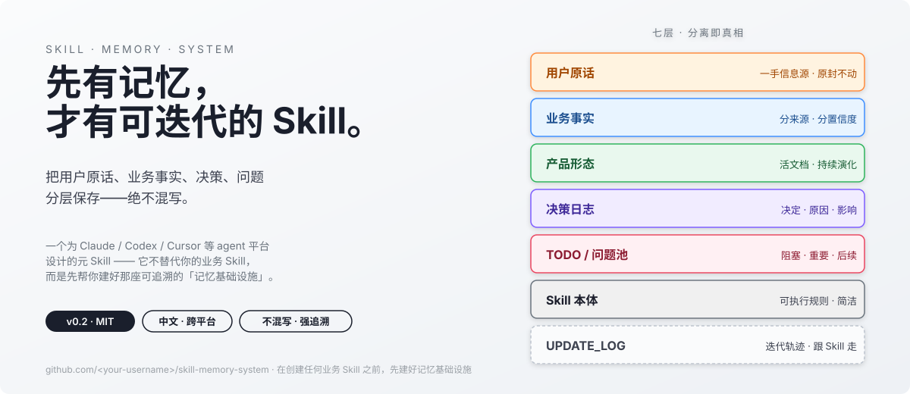

<div align="center">

# skill-memory-system

**先有记忆，才有可迭代的 Skill。**

[](./LICENSE)
[](./SKILL.md)
[](./agents/)
[](#-贡献指南)



<sub>一个为 Claude / Codex / Cursor 等 agent 平台设计的「元 Skill」——<br/>它不替代你的业务 Skill，而是先帮你建好那座可追溯的「记忆基础设施」。</sub>

</div>

---

## 📖 目录

- [为什么需要这个 Skill](#-为什么需要这个-skill)
- [它适合谁，不适合谁](#-它适合谁不适合谁)
- [30 秒上手](#-30-秒上手)
- [工作原理](#-工作原理)
- [对比：有它 vs 没它](#-对比有它-vs-没它)
- [完整示例](#-完整示例)
- [文件结构](#-文件结构)
- [FAQ](#-faq)
- [Roadmap](#-roadmap)
- [贡献指南](#-贡献指南)
- [License](#-license)

---

## 💡 为什么需要这个 Skill

几乎所有用 Claude / Codex 这类 agent 写过 Skill 的人，都踩过这三个坑：

1. **聊到第 20 轮，AI 把自己当时的推断当成了用户的原话。** 等用户反问「我什么时候说过这个？」时，已经无法追溯。
2. **Skill 跑了几次发现规则不准，但没人知道当初为什么这么写。** 想改不敢改。
3. **第二个 agent 加入审查，结果两个 agent 互相覆盖彼此的笔记，干脆退化成一个 agent 单干。**

这三个问题的根源是同一个：**用户的一手信息、AI 的二手理解、设计决策的依据，这三层从一开始就没分开存放。**

`skill-memory-system` 不是另一个业务 Skill，它是一个**元 Skill**——在你创建任何真正的业务 Skill 之前，它先帮你建好那套可追溯、可协作、可迭代的记忆层。让你后续的 Skill 能通过真实使用「逐步变准」，而不是只依赖聊天上下文的短期记忆。

> 一句话：**把用户原话、业务事实、决策、问题分层保存——绝不混写。**

---

## 🎯 它适合谁，不适合谁

| 适合 ✅ | 不适合 ❌ |
|---|---|
| 准备做一个**会长期演进**的业务 Skill | 写一个一次性、可丢弃的临时 prompt |
| 与 **多个 agent 协作**设计 Skill（如 Claude + Codex 互审） | 单人单 agent 临时拼一段提示词 |
| 跨多轮对话、跨多个会话推进同一个 Skill 项目 | 5 分钟能搞定的小工具 |
| 需要事后向团队 / 客户解释「为什么这样设计」 | 私人玩具项目，不在意可追溯性 |
| 希望真实样本能反哺规则迭代（如运营复盘类 Skill） | 规则不会变的纯工具 Skill（如格式转换） |

---

## ⚡ 30 秒上手

### 1. 安装

把本仓库 clone 到你的 Skill 工作目录：

```bash
git clone https://github.com/<your-username>/skill-memory-system.git
```

或者复制到 Claude / Codex 的 skills 目录：

```bash
# Claude / Cowork
cp -r skill-memory-system ~/.claude/skills/

# OpenAI Codex（按你的环境调整路径）
cp -r skill-memory-system ~/.codex/skills/
```

### 2. 触发

在 agent 里直接说出意图即可，Skill 会自动激活：

```
我要做一个 XXX 方向的 Skill，帮我先建好记忆体系。
```

或者更直白：

```
用 skill-memory-system 为这个项目建立留存与迭代文档体系。
```

### 3. 看 Skill 干了什么

激活后，agent 会在你的工作目录旁边建一个记忆目录（命名自定，如 `memory/`、`notes/`），并写入：

```
memory/
├── 用户原话.md       ← 你的话，原封不动
├── 业务事实.md       ← 已确认事实，分来源分置信度
├── Skill产品形态.md   ← 当前 Skill 长什么样
├── 决策日志.md       ← 为什么这样设计
├── TODO.md          ← 任务状态
└── 问题池.md         ← 待解答问题，分优先级
```

随后每一轮对话，agent 都会按规则**追加**而不是覆盖。

> 不知道每个文件长什么样？看 [`examples/memory-sample/`](./examples/memory-sample/) 里的真实样本。

---

## 🏗 工作原理

核心是一条铁律：**用户原话和 AI 理解必须分开文件存放，永不混写。**

具体落实为七层：

```text
用户原话    → 一手信息源，原封不动
业务事实    → 已确认的领域事实（分来源，分置信度）
产品形态    → 当前 Skill 长什么样（活文档）
决策日志    → 为什么这样设计（决定 / 原因 / 影响）
TODO/问题池 → 还没解决什么，什么阻塞了落地
Skill 本体  → 可执行规则
更新日志    → 这个 Skill 如何变化（跟着 Skill 本体走）
```

每一层都有自己的写入规则、红线和模板。详见 [`SKILL.md`](./SKILL.md)，模板在 [`references/templates.md`](./references/templates.md)。

### 关键设计

- **业务事实四区分**：用户一手 / 源文件 / AI 推断（标置信度）/ 已被修正。被纠正的事实不删除，保留划线记录，让修正轨迹可追溯。
- **问题池三层级**：🔴 阻塞 / 🟡 重要 / 🟢 后续。阻塞级未解答时，不允许推进依赖它的设计决策。
- **审查区默认不创建**：只有用户明确说「让两个 AI 一起做」时才激活，避免强加协作开销。
- **多 agent 编号分配**：用户原话只有一份，主记忆区维护者负责追加编号，审查区只读不写，杜绝覆盖冲突。
- **UPDATE_LOG 跟 Skill 走**：记忆目录是项目级的，但每个业务 Skill 自己有独立的更新日志，分发时一起带走。

---

## ⚖️ 对比：有它 vs 没它

| 场景 | 没有记忆系统 | 用本 Skill |
|---|---|---|
| 用户说「我什么时候说过这个？」 | 翻聊天记录 30 分钟 | 一秒定位到 `用户原话.md` 的 U00X 编号 |
| Skill 跑出来不准想改 | 不知道当初为什么这么写 | `决策日志.md` 三段式：决定 / 原因 / 影响 |
| 两个 agent 协作 | 互相覆盖笔记 | 角色对等、文件分区、分歧明确记录 |
| 半年后再开这个项目 | 上下文全丢 | 记忆目录就是冷启动文档 |
| AI 推断被用户纠正 | 改完没痕迹 | 「已被修正」区保留划线 + 修正出处 |
| 真实样本暴露规则缺陷 | 改了忘了为什么改 | `UPDATE_LOG.md` 强制记录来源 / 问题 / 修改 / 影响 |

---

## 📦 完整示例

[`examples/memory-sample/`](./examples/memory-sample/) 提供一个虚构 Skill 项目（面部瑜伽直播复盘 Skill）的最小可用样本，让你 2 分钟看清结构：

- [`用户原话.md`](./examples/memory-sample/用户原话.md) — 编号 + 引号 + 不改写
- [`业务事实.md`](./examples/memory-sample/业务事实.md) — 四区分法的真实写法
- [`决策日志.md`](./examples/memory-sample/决策日志.md) — 三段式决策记录
- [`问题池.md`](./examples/memory-sample/问题池.md) — 三优先级 + 已解答归档

---

## 📂 文件结构

```
skill-memory-system/
├── README.md                   ← 你正在读的这个
├── SKILL.md                    ← Skill 本体（规则 + 工作流）
├── LICENSE                     ← MIT
├── agents/                     ← 跨 agent 平台元数据
│   ├── README.md
│   └── openai.yaml             ← OpenAI / Codex 界面元数据
├── examples/                   ← 最小可用样本
│   ├── README.md
│   └── memory-sample/
│       ├── 用户原话.md
│       ├── 业务事实.md
│       ├── 决策日志.md
│       └── 问题池.md
├── references/
│   └── templates.md            ← 各文件的 Markdown 模板
└── assets/
    └── hero.svg                ← README 顶部 hero 图
```

---

## ❓ FAQ

<details>
<summary><b>Q1：这跟普通的「项目笔记」有什么区别？</b></summary>

普通项目笔记不强制分层，写着写着就把 AI 的推断和用户的原话混在一起，后期没法追溯。本 Skill 把分层规则写死成铁律：**用户原话和 AI 理解永不混写**。
</details>

<details>
<summary><b>Q2：每次对话都让 AI 维护这么多文件，不是很重吗？</b></summary>

只有在做「会长期演进的业务 Skill」时才用。一次性 prompt、5 分钟小工具不需要。Skill 的 description 已写明反向条件，不会被随便触发。
</details>

<details>
<summary><b>Q3：审查区是必须的吗？</b></summary>

不是。审查区默认不创建，只有你明确说「让两个 AI 一起做」「需要第二视角审查」时才激活。单人单 agent 工作流完全够用。
</details>

<details>
<summary><b>Q4：为什么文件名是中文？老外用怎么办？</b></summary>

文件名设计为中文是因为本 Skill 的主要使用场景是中文 Skill 项目，中文文件名让 agent 在写入时不会和英文路径混淆。如果你需要英文版，可以在 `references/templates.md` 基础上做一份英文模板提交 PR。
</details>

<details>
<summary><b>Q5：能跟我现有的笔记工具（Obsidian / Logseq）一起用吗？</b></summary>

可以。记忆目录就是普通 Markdown 文件，Obsidian / Logseq 等工具能直接索引。Skill 不依赖任何特定的笔记软件。
</details>

<details>
<summary><b>Q6：UPDATE_LOG.md 为什么不放在记忆目录里？</b></summary>

记忆目录是项目级的（一个项目一套），但 UPDATE_LOG 是 Skill 级的（一个业务 Skill 一份）。你最终把业务 Skill 分发出去时，UPDATE_LOG 应该跟着 Skill 走，让别人能看到迭代轨迹；而记忆目录通常是私有的，不分发。
</details>

<details>
<summary><b>Q7：能在 Cursor / Windsurf / 其他 agent 平台用吗？</b></summary>

理论上可以。Skill 的触发逻辑只依赖 `SKILL.md` 的 `description` 字段，模板都是平台无关的 Markdown。`agents/` 目录预留了跨平台元数据接口，欢迎 PR 加入新平台的适配文件。
</details>

---

## 🗺 Roadmap

- [x] **v0.1** — 基础七层结构 + Markdown 模板
- [x] **v0.2** — 模块化（SKILL.md 瘦身 / examples 样本 / 跨 agent 适配说明）
- [ ] **v0.3** — 英文版模板（`references/templates.en.md`）
- [ ] **v0.4** — 提供 CLI 工具，一键初始化记忆目录骨架
- [ ] **v0.5** — `eval/` 目录：自动检测「AI 推断有没有偷偷写进已确认事实」
- [ ] **v1.0** — 真实项目沉淀 3+ 个完整案例后正式发布

欢迎在 [Issues](../../issues) 提需求或讨论。

---

## 🤝 贡献指南

欢迎 PR！本项目偏文档型，贡献门槛很低：

1. **改 Bug / 优化措辞**：直接提 PR，描述清楚改了什么、为什么。
2. **新增模板 / 示例**：在 `examples/` 或 `references/` 下加，保持「最小可用」原则——示例越短越好，越短越好懂。
3. **加新的 agent 平台支持**：在 `agents/` 下加一个对应文件，不要改 `SKILL.md` 的触发逻辑。
4. **大改前请先开 Issue**：尤其是触发条件、分层规则、文件命名这类核心设计，先讨论后动手。

代码风格：

- 不堆砌 emoji（顶部锚点的 emoji 是例外，便于扫描）
- 不用 HTML 报告做输出（与本 Skill 的克制风格冲突）
- 中文标点全角，英文标点半角，混排时用半角空格分隔

---

## 📄 License

[MIT](./LICENSE) © 2026 big-yanmai

---

<div align="center">
<sub>如果这个 Skill 帮你少踩了几个坑，欢迎 ⭐ Star，让更多人看到。</sub>
</div>
